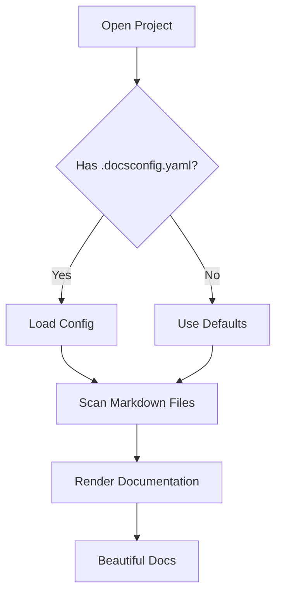

# Sample Project

Welcome to the Sample Project! This project demonstrates how DocMark renders markdown documentation.

## Features

- Beautiful markdown rendering with syntax highlighting
- Support for Mermaid diagrams and KaTeX math equations
- GitHub-style admonitions (callouts)
- Table of Contents generation
- Git integration

## Quick Start

1. Open this folder in DocMark
2. Browse the sidebar to explore documentation
3. Use `Cmd+K` to search across all documents
4. Use `Cmd+P` to quickly open any file

## Code Example

```python
def fibonacci(n: int) -> int:
    if n <= 1:
        return n
    return fibonacci(n - 1) + fibonacci(n - 2)

print(fibonacci(10))
```

```typescript
interface User {
  id: string;
  name: string;
  email: string;
  createdAt: Date;
}

async function getUser(id: string): Promise<User> {
  const response = await fetch(`/api/users/${id}`);
  return response.json();
}
```

## Mermaid Diagram



## Math Equations

The quadratic formula is $x = \frac{-b \pm \sqrt{b^2 - 4ac}}{2a}$.

Euler's identity:

$$e^{i\pi} + 1 = 0$$

The sum of the first $n$ natural numbers:

$$\sum_{k=1}^{n} k = \frac{n(n+1)}{2}$$

## Admonitions

> [!NOTE]
> DocMark supports GitHub-style admonitions for highlighting important information.

> [!TIP]
> Use `Cmd+T` to toggle the Table of Contents panel.

> [!IMPORTANT]
> Make sure your project has at least one `.md` file for DocMark to display.

> [!WARNING]
> Mermaid diagrams and math equations require an internet connection for first load.

> [!CAUTION]
> DocMark is a read-only viewer. It does not modify your markdown files.

## Tables

| Feature | Free | Pro |
|---------|------|-----|
| Markdown Rendering | Yes | Yes |
| Syntax Highlighting | Yes | Yes |
| Project Management | 1 project | Unlimited |
| Full-Text Search | Yes | Yes |
| Mermaid Diagrams | No | Yes |
| Math Equations | No | Yes |
| Git Integration | No | Yes |
| Table of Contents | No | Yes |

## Links

- [Architecture Decisions](docs/adr/ADR-001-use-swiftui.md)
- [Getting Started Guide](docs/guides/getting-started.md)
- [Users API](docs/api/users.md)
