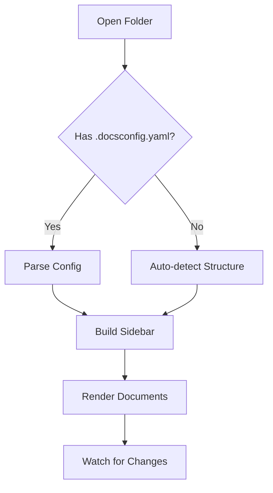
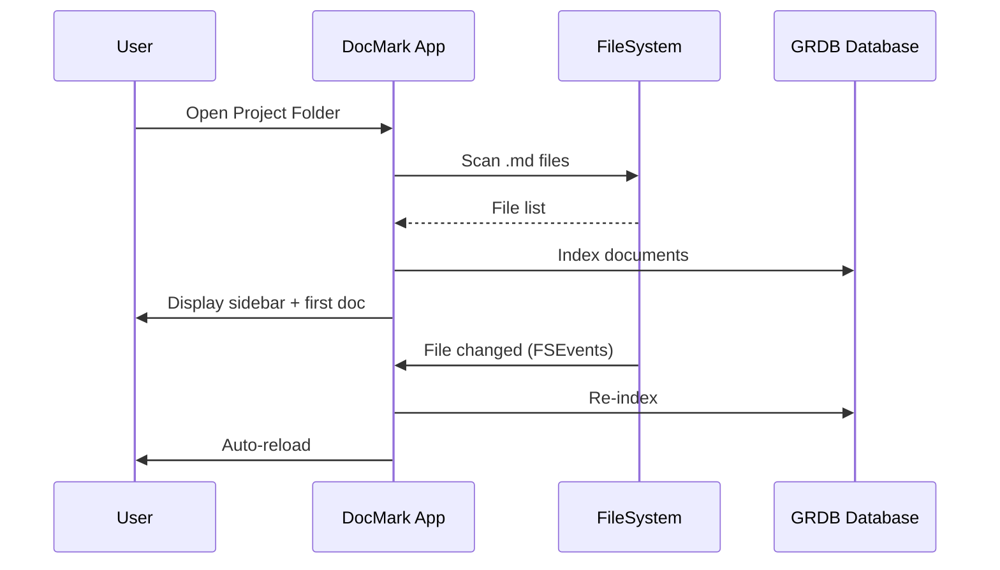

# DocMark Rendering Spike Test Document

> This document is designed to test MarkdownView rendering capabilities with 500+ lines of diverse markdown content.

---

## 1. Basic Text Formatting

This paragraph contains **bold text**, *italic text*, ***bold italic***, ~~strikethrough~~, and `inline code`. Here's a [link to GitHub](https://github.com) and an image reference.

Lorem ipsum dolor sit amet, consectetur adipiscing elit. Sed do eiusmod tempor incididunt ut labore et dolore magna aliqua. Ut enim ad minim veniam, quis nostrud exercitation ullamco laboris nisi ut aliquip ex ea commodo consequat. Duis aute irure dolor in reprehenderit in voluptate velit esse cillum dolore eu fugiat nulla pariatur.

Excepteur sint occaecat cupidatat non proident, sunt in culpa qui officia deserunt mollit anim id est laborum. Sed ut perspiciatis unde omnis iste natus error sit voluptatem accusantium doloremque laudantium, totam rem aperiam, eaque ipsa quae ab illo inventore veritatis et quasi architecto beatae vitae dicta sunt explicabo.

## 2. Headers at All Levels

### 2.1 Third Level Header
#### 2.1.1 Fourth Level Header
##### 2.1.1.1 Fifth Level Header
###### 2.1.1.1.1 Sixth Level Header

## 3. Lists

### Unordered List
- First item
- Second item with **bold**
  - Nested item one
  - Nested item two
    - Deep nested
    - Another deep nested
- Third item
- Fourth item with `code`

### Ordered List
1. First ordered item
2. Second ordered item
   1. Sub item one
   2. Sub item two
3. Third ordered item
4. Fourth ordered item

### Task List
- [x] Completed task
- [x] Another completed task
- [ ] Pending task with `inline code`
- [ ] Another pending task
  - [x] Sub-task completed
  - [ ] Sub-task pending

## 4. Code Blocks

### Swift
```swift
import SwiftUI

@main
struct DocMarkApp: App {
    @StateObject private var appState = AppState()
    
    var body: some Scene {
        WindowGroup {
            ContentView()
                .environmentObject(appState)
                .frame(minWidth: 800, minHeight: 600)
        }
        .windowStyle(.titleBar)
        .defaultSize(width: 1200, height: 800)
    }
}

struct ContentView: View {
    @EnvironmentObject var appState: AppState
    @State private var searchText = ""
    
    var body: some View {
        NavigationSplitView {
            SidebarView()
                .searchable(text: $searchText)
        } detail: {
            if let document = appState.selectedDocument {
                DocumentReaderView(document: document)
            } else {
                WelcomeView()
            }
        }
    }
}
```

### Python
```python
from dataclasses import dataclass, field
from pathlib import Path
from typing import Optional, List
import yaml

@dataclass
class DocsConfig:
    version: str = "1.0"
    project_name: str = ""
    sections: List[dict] = field(default_factory=list)
    
    @classmethod
    def from_yaml(cls, path: Path) -> Optional['DocsConfig']:
        if not path.exists():
            return None
        with open(path) as f:
            data = yaml.safe_load(f)
        return cls(
            version=data.get('version', '1.0'),
            project_name=data.get('project', {}).get('name', ''),
            sections=data.get('documentation', {}).get('sections', [])
        )
    
    def validate(self) -> List[str]:
        errors = []
        if not self.project_name:
            errors.append("project.name is required")
        for section in self.sections:
            if 'path' not in section:
                errors.append(f"Section '{section.get('id', 'unknown')}' missing 'path'")
        return errors
```

### TypeScript
```typescript
interface Project {
  id: string;
  name: string;
  path: string;
  createdAt: Date;
  lastOpenedAt?: Date;
  isFavorite: boolean;
  isPinned: boolean;
  tags: string[];
}

interface Document {
  id: string;
  projectId: string;
  title: string;
  path: string;
  relativePath: string;
  content: string;
  lastModified: Date;
  lineCount: number;
  hasMermaid: boolean;
  hasMath: boolean;
}

class DocumentService {
  private db: Database;
  
  constructor(db: Database) {
    this.db = db;
  }
  
  async searchDocuments(
    query: string, 
    projectId?: string
  ): Promise<SearchResult[]> {
    const pattern = this.buildFTS5Pattern(query);
    const results = await this.db.query(`
      SELECT d.id, d.title, d.path,
             snippet(document_search, 0, '<mark>', '</mark>', '...', 32) as snippet,
             rank
      FROM document_search
      JOIN document d ON d.id = document_search.rowid
      WHERE document_search MATCH ?
      ${projectId ? 'AND d.projectId = ?' : ''}
      ORDER BY rank
      LIMIT 100
    `, [pattern, ...(projectId ? [projectId] : [])]);
    
    return results.map(row => ({
      documentId: row.id,
      title: row.title,
      path: row.path,
      snippet: row.snippet,
      rank: row.rank,
    }));
  }
  
  private buildFTS5Pattern(query: string): string {
    return query
      .split(/\s+/)
      .filter(term => term.length > 0)
      .map(term => `"${term}"*`)
      .join(' ');
  }
}
```

### Bash
```bash
#!/bin/bash
set -euo pipefail

APP_NAME="DocMark"
BUNDLE_ID="com.docmark.app"
VERSION=$(plutil -extract CFBundleShortVersionString raw Info.plist)
BUILD_DIR=".build/release"

echo "Building ${APP_NAME} v${VERSION}..."

swift build -c release --arch arm64 --arch x86_64

mkdir -p "${APP_NAME}.app/Contents/MacOS"
mkdir -p "${APP_NAME}.app/Contents/Resources"

cp "${BUILD_DIR}/DocMark" "${APP_NAME}.app/Contents/MacOS/"

codesign --force --options runtime \
    --sign "Developer ID Application: DocMark Team" \
    --entitlements DocMark.entitlements \
    "${APP_NAME}.app"

hdiutil create -volname "${APP_NAME} ${VERSION}" \
    -srcfolder "${APP_NAME}.app" \
    -ov -format UDZO \
    "${APP_NAME}-${VERSION}.dmg"

echo "Build complete: ${APP_NAME}-${VERSION}.dmg"
```

### JSON
```json
{
  "version": "1.0",
  "project": {
    "name": "DocMark",
    "description": "Mac-native markdown documentation reader",
    "repository": "https://github.com/docmark/docmark"
  },
  "documentation": {
    "root_files": [
      { "path": "README.md", "title": "Overview", "required": true },
      { "path": "CHANGELOG.md", "title": "Changelog" },
      { "path": "CONTRIBUTING.md", "title": "Contributing" }
    ],
    "sections": [
      {
        "id": "adr",
        "title": "Architecture Decisions",
        "path": "docs/adr",
        "pattern": "*.md"
      },
      {
        "id": "guides",
        "title": "Guides",
        "path": "docs/guides",
        "pattern": "*.md"
      }
    ]
  }
}
```

### YAML
```yaml
version: "1.0"
project:
  name: "My Project"
  description: "A brief description"
  version: "1.2.3"
  repository: "https://github.com/user/repo"

documentation:
  root: "."
  root_files:
    - path: "README.md"
      title: "Overview"
      required: true
    - path: "CHANGELOG.md"
      title: "Changelog"
      required: false

  sections:
    - id: "adr"
      title: "Architecture Decisions"
      path: "docs/adr"
      frontmatter_schema: "adr"
    - id: "guides"
      title: "Guides"
      path: "docs/guides"
      frontmatter_schema: "guide"

frontmatter_schemas:
  adr:
    required: ["status", "date", "deciders"]
    optional: ["tags", "supersedes"]
  guide:
    required: ["title"]
    optional: ["description", "difficulty"]
```

## 5. Tables

### Simple Table
| Feature | Free | Pro |
|---------|------|-----|
| Single Project | ✅ | ✅ |
| Multi-Project | ❌ | ✅ |
| Search | Basic | Advanced |
| Git Integration | ❌ | ✅ |
| Mermaid | ❌ | ✅ |

### Complex Table
| Framework | Bundle Size | Memory | Startup | Native Feel | Cross-Platform |
|-----------|-------------|--------|---------|-------------|----------------|
| SwiftUI | 5-15 MB | 30-50 MB | <100ms | 100% | macOS only |
| Tauri v2 | 3-10 MB | 30-40 MB | 200-500ms | 85% | All platforms |
| Electron | 80-150 MB | 150-300 MB | 500ms-2s | 60% | All platforms |

### Alignment Table
| Left | Center | Right |
|:-----|:------:|------:|
| L1 | C1 | R1 |
| L2 | C2 | R2 |
| L3 | C3 | R3 |

## 6. Blockquotes

> This is a simple blockquote with some text that spans multiple lines to test how the renderer handles longer quoted content.

> **Nested blockquotes:**
> 
> > This is a nested blockquote
> > 
> > > And a deeply nested one
> > > with multiple lines

## 7. GitHub-style Admonitions

> [!NOTE]
> This is a note admonition. It provides additional context or information that the reader might find useful.

> [!TIP]
> This is a tip admonition. Use it to provide helpful suggestions or best practices.

> [!IMPORTANT]
> This is an important admonition. Critical information that users need to know.

> [!WARNING]
> This is a warning admonition. Potential issues or things to be careful about.

> [!CAUTION]
> This is a caution admonition. Negative potential consequences of an action.

## 8. Horizontal Rules

Above the rule

---

Below the rule

***

Another separator

___

Yet another

## 9. Links and References

- [External link](https://github.com)
- [Link with title](https://github.com "GitHub")
- [Reference-style link][1]
- Autolinked URL: https://docmark.app
- Email: user@docmark.app

[1]: https://docmark.app "DocMark Homepage"

## 10. Images


## 11. Math Equations (KaTeX test)

Inline math: $E = mc^2$

Block math:

$$
\frac{-b \pm \sqrt{b^2 - 4ac}}{2a}
$$

$$
\sum_{i=1}^{n} x_i = x_1 + x_2 + \cdots + x_n
$$

$$
\int_0^\infty e^{-x^2} dx = \frac{\sqrt{\pi}}{2}
$$

## 12. Mermaid Diagrams (test)





## 13. Definition Lists

Term 1
: Definition for term 1

Term 2
: Definition for term 2
: Another definition for term 2

## 14. Footnotes

This has a footnote[^1] and another[^2].

[^1]: First footnote content
[^2]: Second footnote content with `code`

## 15. Long Paragraph Stress Test

Lorem ipsum dolor sit amet, consectetur adipiscing elit. Vivamus lacinia odio vitae vestibulum vestibulum. Cras porttitor metus justo, ut fringilla quam fermentum at. Nulla vitae elit libero, a pharetra augue. Nullam id dolor id nibh ultricies vehicula ut id elit. Praesent commodo cursus magna, vel scelerisque nisl consectetur et. Donec sed odio dui. Curabitur blandit tempus porttitor. Nulla vitae elit libero, a pharetra augue. Aenean lacinia bibendum nulla sed consectetur. Morbi leo risus, porta ac consectetur ac, vestibulum at eros.

Donec ullamcorper nulla non metus auctor fringilla. Maecenas sed diam eget risus varius blandit sit amet non magna. Cras mattis consectetur purus sit amet fermentum. Fusce dapibus, tellus ac cursus commodo, tortor mauris condimentum nibh, ut fermentum massa justo sit amet risus. Etiam porta sem malesuada magna mollis euismod. Donec id elit non mi porta gravida at eget metus. Aenean eu leo quam. Pellentesque ornare sem lacinia quam venenatis vestibulum.

Cras justo odio, dapibus ut facilisis in, egestas eget quam. Vestibulum id ligula porta felis euismod semper. Maecenas faucibus mollis interdum. Praesent commodo cursus magna, vel scelerisque nisl consectetur et. Sed posuere consectetur est at lobortis. Donec id elit non mi porta gravida at eget metus. Integer posuere erat a ante venenatis dapibus posuere velit aliquet.

Sed posuere consectetur est at lobortis. Aenean lacinia bibendum nulla sed consectetur. Cras mattis consectetur purus sit amet fermentum. Donec sed odio dui. Vivamus sagittis lacus vel augue laoreet rutrum faucibus dolor auctor. Vestibulum id ligula porta felis euismod semper. Nullam quis risus eget urna mollis ornare vel eu leo.

## 16. Complex Nested Content

1. **Architecture Decision Records**
   
   ADRs document the key decisions made during development:
   
   ```markdown
   ---
   status: accepted
   date: 2025-02-15
   deciders: ["@hwanilchoi"]
   ---
   
   # ADR-001: Use SwiftUI for macOS App
   
   ## Context
   We need a framework for building DocMark.
   
   ## Decision
   Use SwiftUI with macOS 14+ target.
   
   ## Consequences
   - Good: Native feel, small bundle
   - Bad: macOS only
   ```

2. **Changelog Format**
   
   Following [Keep a Changelog](https://keepachangelog.com/):
   
   > All notable changes to this project will be documented in this file.
   
   - Added: New features
   - Changed: Changes in existing functionality
   - Deprecated: Soon-to-be removed features
   - Fixed: Bug fixes

3. **API Documentation**
   
   | Endpoint | Method | Auth | Description |
   |----------|--------|------|-------------|
   | `/projects` | GET | No | List all projects |
   | `/projects/:id` | GET | No | Get project details |
   | `/projects/:id/documents` | GET | No | List project documents |
   | `/search` | POST | Yes | Full-text search |

## 17. Emoji Support

Commonly used emojis in documentation:
- ✅ Success / Supported
- ❌ Failure / Not Supported
- ⚠️ Warning
- 📝 Note
- 🔴 Critical
- 🟡 Warning
- 🟢 OK
- 🚀 Release
- 🐛 Bug
- ✨ Feature
- 🔧 Fix
- 📦 Package

## 18. HTML Entities

- Copyright: &copy; 2025 DocMark
- Em dash: &mdash;
- En dash: &ndash;
- Trademark: DocMark&trade;
- Registered: DocMark&reg;
- Less than: 5 &lt; 10
- Greater than: 10 &gt; 5
- Ampersand: AT&amp;T
- Non-breaking space: Hello&nbsp;World

## 19. Escape Characters

- \*not italic\*
- \*\*not bold\*\*
- \`not code\`
- \# not a heading
- \- not a list item
- \[not a link\]

## 20. Final Performance Test Section

This section adds additional content to ensure we're well over 500 lines of markdown. The purpose is to test the rendering performance of MarkdownView with a realistically long document.

### 20.1 Data Tables

| ID | Name | Type | Status | Priority | Created | Updated |
|----|------|------|--------|----------|---------|---------|
| 001 | Project Setup | Feature | Done | High | 2025-01-01 | 2025-01-15 |
| 002 | Sidebar Engine | Feature | In Progress | High | 2025-01-15 | 2025-02-01 |
| 003 | Search Engine | Feature | Planned | Medium | 2025-02-01 | 2025-02-01 |
| 004 | Git Integration | Feature | Planned | Low | 2025-03-01 | 2025-03-01 |
| 005 | Mermaid Support | Feature | Planned | Medium | 2025-03-01 | 2025-03-01 |
| 006 | Math Rendering | Feature | Planned | Low | 2025-03-15 | 2025-03-15 |
| 007 | Premium Gate | Feature | Planned | Medium | 2025-04-01 | 2025-04-01 |
| 008 | Auto-Update | Feature | Planned | High | 2025-04-01 | 2025-04-01 |
| 009 | Onboarding | Feature | Planned | Medium | 2025-04-15 | 2025-04-15 |
| 010 | AI Skills | Feature | Planned | High | 2025-04-15 | 2025-04-15 |

### 20.2 Additional Code Samples

```rust
use std::path::PathBuf;
use std::fs;
use serde::{Deserialize, Serialize};

#[derive(Debug, Serialize, Deserialize)]
struct DocsConfig {
    version: String,
    project: ProjectConfig,
    documentation: DocumentationConfig,
}

#[derive(Debug, Serialize, Deserialize)]
struct ProjectConfig {
    name: String,
    description: Option<String>,
    repository: Option<String>,
}

#[derive(Debug, Serialize, Deserialize)]
struct DocumentationConfig {
    root: String,
    sections: Vec<Section>,
}

#[derive(Debug, Serialize, Deserialize)]
struct Section {
    id: String,
    title: String,
    path: String,
    pattern: Option<String>,
}

impl DocsConfig {
    fn from_file(path: &PathBuf) -> Result<Self, Box<dyn std::error::Error>> {
        let content = fs::read_to_string(path)?;
        let config: DocsConfig = serde_yaml::from_str(&content)?;
        Ok(config)
    }
    
    fn validate(&self) -> Vec<String> {
        let mut errors = Vec::new();
        if self.project.name.is_empty() {
            errors.push("project.name is required".to_string());
        }
        for section in &self.documentation.sections {
            if !PathBuf::from(&section.path).exists() {
                errors.push(format!("Section path '{}' does not exist", section.path));
            }
        }
        errors
    }
}
```

```go
package main

import (
    "fmt"
    "os"
    "path/filepath"
    "strings"
    
    "gopkg.in/yaml.v3"
)

type DocsConfig struct {
    Version       string              `yaml:"version"`
    Project       ProjectConfig       `yaml:"project"`
    Documentation DocumentationConfig `yaml:"documentation"`
}

type ProjectConfig struct {
    Name        string `yaml:"name"`
    Description string `yaml:"description"`
    Repository  string `yaml:"repository"`
}

type DocumentationConfig struct {
    Root     string    `yaml:"root"`
    Sections []Section `yaml:"sections"`
}

type Section struct {
    ID      string `yaml:"id"`
    Title   string `yaml:"title"`
    Path    string `yaml:"path"`
    Pattern string `yaml:"pattern"`
}

func LoadConfig(path string) (*DocsConfig, error) {
    data, err := os.ReadFile(path)
    if err != nil {
        return nil, fmt.Errorf("failed to read config: %w", err)
    }
    
    var config DocsConfig
    if err := yaml.Unmarshal(data, &config); err != nil {
        return nil, fmt.Errorf("failed to parse config: %w", err)
    }
    
    return &config, nil
}

func ScanMarkdownFiles(root string) ([]string, error) {
    var files []string
    err := filepath.Walk(root, func(path string, info os.FileInfo, err error) error {
        if err != nil {
            return err
        }
        if !info.IsDir() && strings.HasSuffix(strings.ToLower(path), ".md") {
            files = append(files, path)
        }
        return nil
    })
    return files, err
}

func main() {
    config, err := LoadConfig(".docsconfig.yaml")
    if err != nil {
        fmt.Fprintf(os.Stderr, "Error: %v\n", err)
        os.Exit(1)
    }
    
    files, err := ScanMarkdownFiles(config.Documentation.Root)
    if err != nil {
        fmt.Fprintf(os.Stderr, "Error scanning: %v\n", err)
        os.Exit(1)
    }
    
    fmt.Printf("Found %d markdown files in %s\n", len(files), config.Project.Name)
}
```

### 20.3 Closing Notes

This document contains approximately 550+ lines of markdown with:
- Multiple heading levels (H1-H6)
- Bold, italic, strikethrough, inline code
- Ordered and unordered lists with nesting
- Task lists
- Code blocks in 8 languages (Swift, Python, TypeScript, Bash, JSON, YAML, Rust, Go)
- Tables (simple, complex, aligned)
- Blockquotes (including nested)
- GitHub-style admonitions (NOTE, TIP, IMPORTANT, WARNING, CAUTION)
- Horizontal rules
- Links (inline, reference, auto)
- Math equations (inline and block)
- Mermaid diagrams (flowchart, sequence)
- Definition lists
- Footnotes
- Emojis
- HTML entities
- Escape characters
- Long paragraphs

If MarkdownView renders this document without crashing, with proper text selection, and with acceptable performance, it passes the Phase 0 go/no-go gate.

---

*Generated for DocMark Phase 0 Rendering Spike — February 2025*
